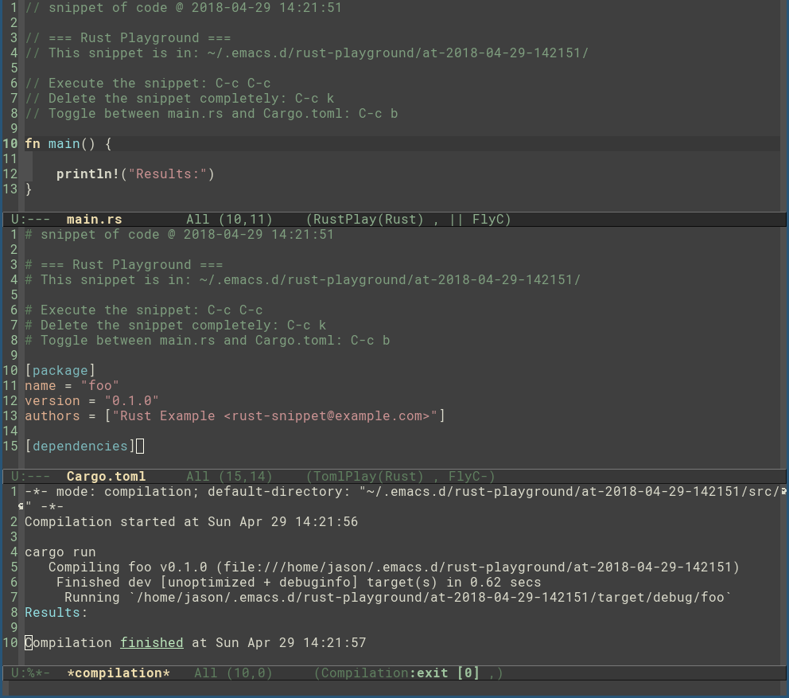

<!-- *- mode:markdown;mode:orgtbl;fill-column:99 -* -->
# rust-playground  

GNU/Emacs mode that setup local playground for code snippets in Rust language.  This is a port of
[go-playground](https://github.com/grafov/go-playground) adapted for Rust environment.

## Install

Install `rust-playground` from MELPA:

    M-x package-install RET rust-playground

The mirror repository of the project: https://notabug.org/grafov/rust-playground.
I really not think that this small project need the mirror but I just would like advertise a nice
git hosting for FOSS. Try [notabug.org](https://notabug.org) for your projects! :)

Example screen after creation of a new snippet:

## Usage

### Quick start

1. From any mode run `M-x rust-playground` for start a new playground buffer filled with basic
   template for the package with main function (see the picture below).
1. Add your code then press `Ctl-Return` (it bound to `rust-playground-exec` command). It will save,
   compile and exec the snippet code.
1. When you played enough with this snippet just run `M-x rust-playground-rm`. It will remove the
   current snippet with its directory and all files.

### List of interactive functions

<!---
#+ORGTBL: SEND keys orgtbl-to-gfm
| Function name              | Description                                                          |
|----------------------------+----------------------------------------------------------------------|
| `rust-playground`          | Create a new playground buffer with basic template for the package.  |
| `rust-playground-download` | [WIP] Download the snippet from the URL at play.rust-lang.org.       |
| `rust-playground-exec`     | Save, compile and run the code of the snippet.                       |
| `rust-playground-upload`   | [WIP] Upload the buffer to play.golang.org and return the short URL. |
| `rust-playground-rm`       | Remove the snippet with its directory with all files.                |
-->
<!--- BEGIN RECEIVE ORGTBL keys -->
| Function name | Description |
|---|---|
| `rust-playground` | Create a new playground buffer with basic template for the package. |
| `rust-playground-download` | [WIP] Download the snippet from the URL at play.rust-lang.org. |
| `rust-playground-exec` | Save, compile and run the code of the snippet. |
| `rust-playground-upload` | [WIP] Upload the buffer to play.golang.org and return the short URL. |
| `rust-playground-rm` | Remove the snippet with its directory with all files. |
<!--- END RECEIVE ORGTBL keys -->

## Project status

The plugin is usable. I've stopped learning Rust yet so this Emacs plugin not very interesting for
me. But I'll continue to maintain it and backport features from `go-playground`. Patches are
welcomed!
